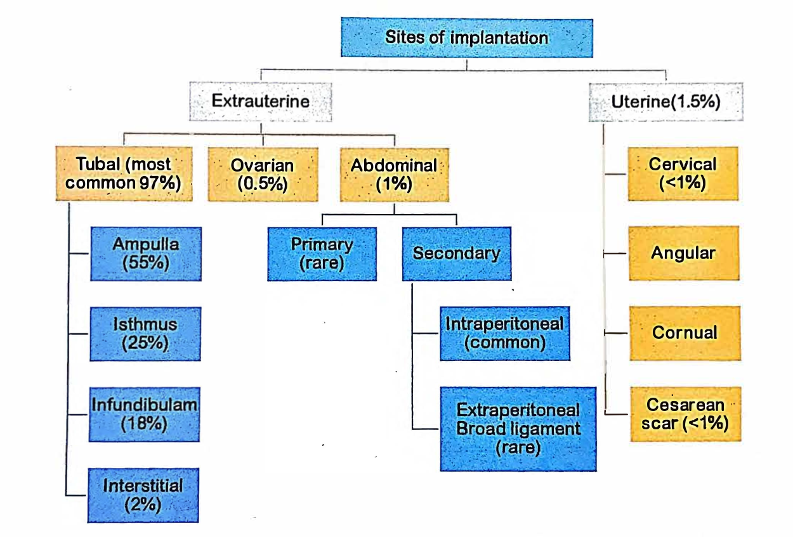

definition:: An ectopic pregnancy is one in which the fertilized ovum is implanted and develops outside the normal endometrial cavity #gyn-prof-card

- # Etiology
	-
	- ## Risk Factors #gyn-prof-card
		- History of pelvic inflammatory disease (PID)
		- History of tubal ligation
		- Contraception failure
		- Previous ectopic pregnancy
		- Tubal reconstructive surgery
		- History of infertility
		- ART particularly if the tubes are patent but damaged
		- [[IUCD]] use
		- Previous induced abortion
		- Tubal endometriosis
- # Common Sites of Ectopic Pregnancy #gyn-prof-card
	- 
- Types according to site
	- ((662c04f4-8caa-40af-b8ab-ab0c59ad776d))
- Risk Factors
	- ((662c06a1-512e-41b8-b34d-3baa0b16ccf8))
- Diagnosis
	- Acute Ectopic
		- ((662c0825-944d-47f4-881c-f6396cfc2896))
	- Unruptured
		- Lower abdominal pain
		- Amonerrhoea
		- PV bleeding
- Investigation
	- Blood examination
	- Estimation of BHCG
	- Sonography
		- ((662c093d-3f52-440f-b31f-7374c4513e31))
	- Laporoscopy
	- Laporotomy
- Management
	- Acute
		- Anti-Shock Treatment
			- Resuscitation with simultaneous preparation for laparatormoy
			- Ringor's Solution IV
			- Arrangement of blood for blood transfusion
		- Laporatomy
			- Indication
				- Patient hemodynamically unstable
				- Laparoscopy contraindicated
				- Evidence of rupture
		- Salphingectomy
		- Subtotal hysteromoy
	- Unrupture
		- Expectant
		  logseq.order-list-type:: number
			- Observation is done with spontaneous resolution
			- Indication
				- Initially BHCG < 1500 IU/L
				- Subsequently fall of BHCG
				- Gestational sac < 4 cm
				- No FHB on TVS
				- No evidence of rupture or bleeding on TBS
		- Conservative
		  logseq.order-list-type:: number
			- Medical
			  logseq.order-list-type:: number
				- Indication
					- Hemodynamically stable
					- BHCG < 3000 IU/L
					- Tubal diameter < 4cm
					- No FHB on TVS
					- No intrabdominal hemorrhage
				- Drug
					- Methotrexate
					- KCl
					- Prostaglandin
					- Actinomycin
			- Conservative Surgery
			  logseq.order-list-type:: number
				- Indication
					- Case not fulfilling criteria of medical therapuy
					- Case where BHCG levels not decreasing inspite of medical therapy
					- Persistent cardiac activity
				- Methods
					- Linera salphingostomy (not ((662c10df-3fc1-407e-9c56-1a3a95db3445)))
					  logseq.order-list-type:: number
					- Segmental resection
					  logseq.order-list-type:: number
					- Salphingectomy
					  logseq.order-list-type:: number
					- Fimbrial expression
					  logseq.order-list-type:: number
		- Salphingotomy
		  logseq.order-list-type:: number